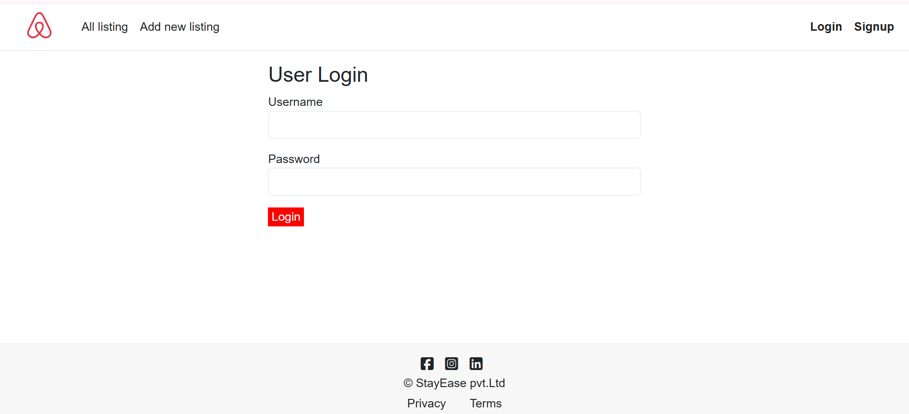
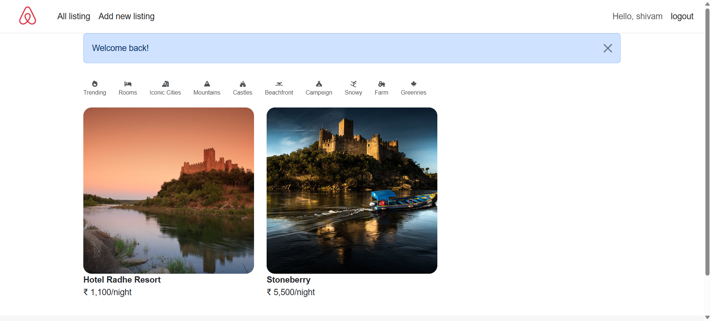
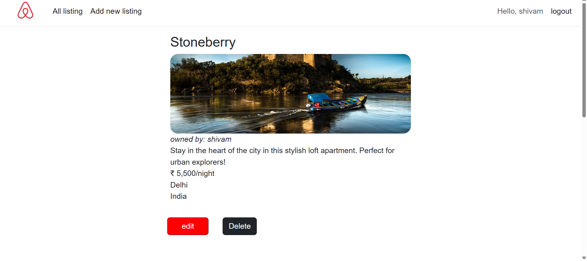
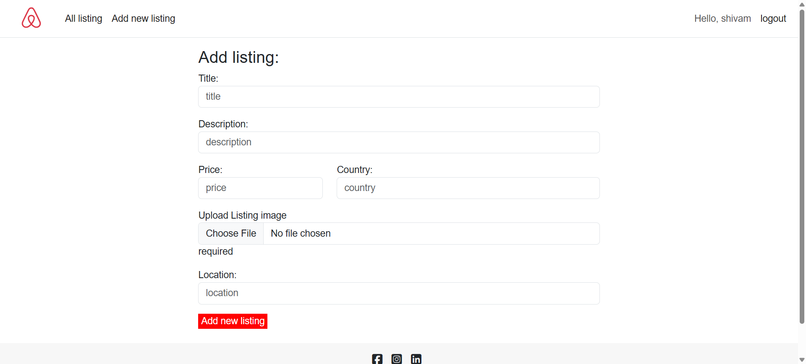
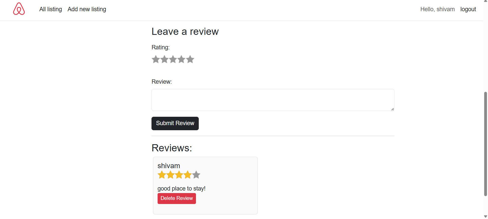

# StayEase 🏨

StayEase is a full-stack homestay booking platform inspired by Airbnb, where users can explore stays, create listings, manage bookings, and leave reviews.

---

## 🚀 Features

- User Authentication & Authorization
- Create, Edit & Delete Listings
- Image Upload Support
- Reviews & Ratings
- Responsive UI
- Session Management
- Flash Messages & Error Handling

---

## 🛠️ Tech Stack

### Frontend
- EJS
- Bootstrap
- HTML5
- CSS3
- JavaScript

### Backend
- Node.js
- Express.js

### Database
- MongoDB
- Mongoose

### Authentication
- Passport.js

---

## 📂 Folder Structure

```bash
StayEase/
│
├── models/
├── routes/
├── controllers/
├── middleware/
├── public/
├── views/
├── utils/
├── app.js
└── package.json
```

---

## ⚙️ Installation

### Clone the repository

```bash
git clone https://github.com/Shivamjaiswal02/StayEase.git
```

### Navigate to project folder

```bash
cd StayEase
```

### Install dependencies

```bash
npm install
```

### Run the project

```bash
npm start
```

---

## 🌐 Environment Variables

Create a `.env` file in the root directory and add:

```env
MONGO_URI=your_mongodb_connection_string
SESSION_SECRET=your_secret_key
CLOUDINARY_CLOUD_NAME=your_cloud_name
CLOUDINARY_KEY=your_key
CLOUDINARY_SECRET=your_secret
```

---

## 📸 Screenshots

### Login Page


### Homepage


### Listing Page


### NewListing Page


### Review Page


---

## 👨‍💻 Author

Shivam Jaiswal

- GitHub: https://github.com/Shivamjaiswal02
- Live: https://stayease-fq40.onrender.com
